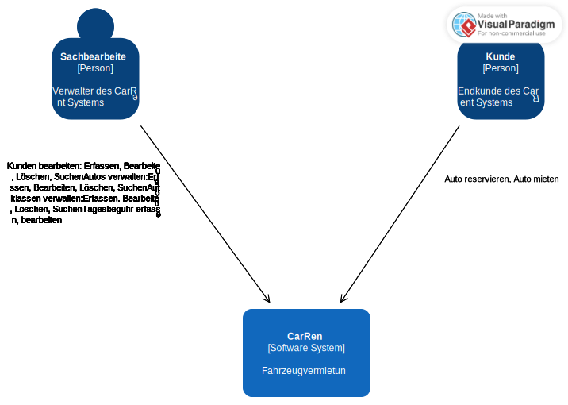
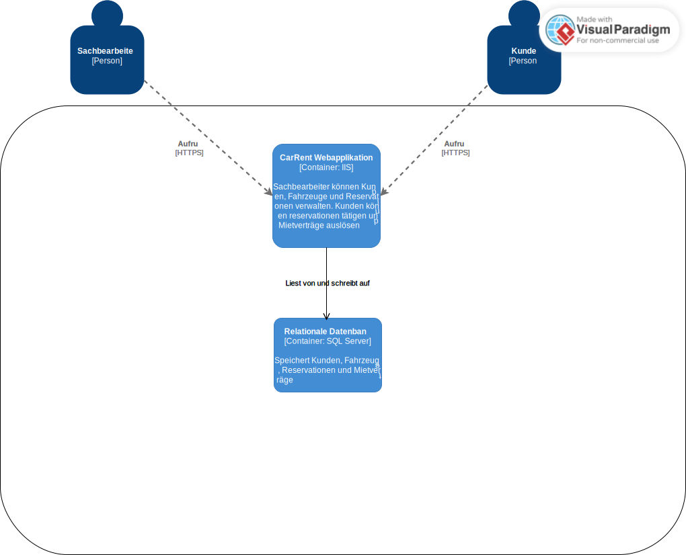
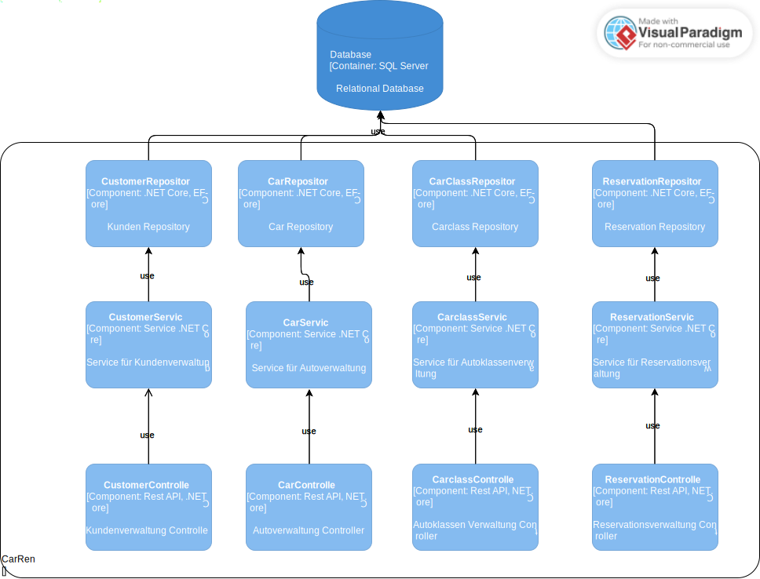
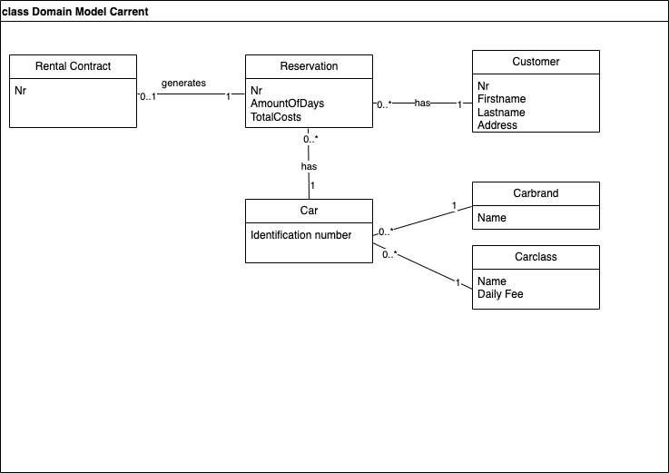
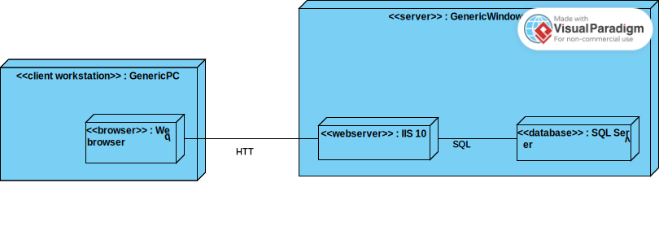

# ZbW.SAD-CarRent

Mini-Projekt CarRent für ZbW SAD

## C4-Pattern

### Context-Diagram

### Container-Diagram

### Components-Diagram

## Use Cases im Brief Format
### UC1: Kunden verwalten

Der Sachbearbeiter kann die Kunden im System verwalten (CRUD). Er kann Kunden nach dessen Namen oder Kundennummer suchen.

### UC2: Autos verwalten

Der Sachbearbeiter kann die Autos im System verwalten (CRUD) und nach diesen Suchen.

### UC3: Autoklassen verwalten

Der Sachbearbeiter kann die Autoklassen verwalten (CRUD), diese den Autos zuordnen und die Tagesgebühr pro Klasse hinterlegen.

### UC4: Reservation tätigen

Als Kunde kann ich Autos nach deren Klassen auswählen und eine Reservation tätigen. Dazu werden die Anzahl Tage angegeben und die Gesamtkosten dafür berechnet. Bei der Speicherung einer Reservation wird eine Reservationsnummer abgelegt.

### UC4: Reservation verwalten und eisehen

Als Kunde möchte ich meine bestehenden Reservation einsehen, stornieren oder anpassen können.

### UC5: Reservation in Miete umwandeln

Als Sachbearbeiter möchte ich bei Abholung eines Autos durch den Kunden die Reservation in einen Mietvertrag umwandeln können.

## Domain Model

## Deployment View

## CI/CD und Metriken
Siehe File: [github workflows yml](.github/workflows/build.yml)